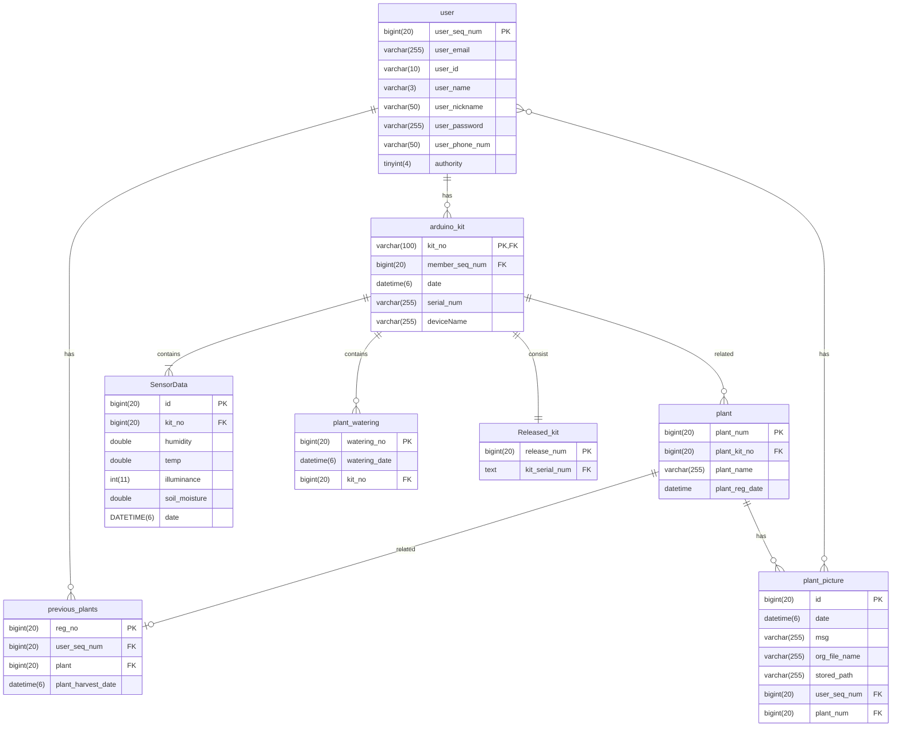

# Project ER Diagram

```mermaid

erDiagram
  user ||--o{ arduino_kit : has
  user ||--o{ previous_plants : has
  arduino_kit ||--o{ plant : related
  arduino_kit ||--|{ SensorData : contains
  arduino_kit ||--o{ plant_watering : contains
	arduino_kit ||--|| Released_kit : consist
  plant ||--o| previous_plants : related
  plant ||--o{ plant_picture : has 
  plant_picture }o--o{ user : has
  
  
  user {
    bigint(20) user_seq_num PK
    varchar(255) user_email
		varchar(10) user_id
    varchar(3) user_name
    varchar(50) user_nickname
    varchar(255) user_password 
    varchar(50) user_phone_num
		tinyint(4)	authority
  }

  arduino_kit {
    varchar(100) kit_no PK,FK
		bigint(20) member_seq_num FK
    datetime(6) date
    varchar(255) serial_num
    varchar(255) deviceName
  }
	
	Released_kit{
		bigint(20) release_num PK
		text kit_serial_num FK
	}

	previous_plants{
    bigint(20) reg_no PK
    bigint(20) user_seq_num FK
    bigint(20) plant FK
    datetime(6) plant_harvest_date
  }

  plant {
    bigint(20) plant_num PK
	bigint(20) plant_kit_no FK
    varchar(255) plant_name
    datetime plant_reg_date
  }

  SensorData {
    bigint(20) id PK
    bigint(20) kit_no FK
    double humidity
    double temp
    int(11) illuminance
    double soil_moisture
    DATETIME(6) date
  }

   plant_watering{
    bigint(20) watering_no PK
    datetime(6) watering_date
    bigint(20) kit_no FK
   }
   plant_picture{
    bigint(20) id PK
    datetime(6) date
    varchar(255) msg
    varchar(255) org_file_name
    varchar(255) stored_path
    bigint(20) user_seq_num FK
    bigint(20) plant_num FK
   }
```