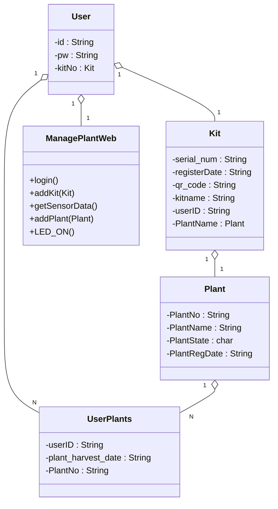

# KEBSmartFarm

# UML Class Diagram



#### ER Diagram

```
mermaid
erDiagram
	Plant ||--|| Plant_info : consist
	Users ||--|{ Kit : has
	UserPlants }|--|| Plant_info : has
	Users ||--|{ UserPlants : has 

	Kit ||--|{ Plant_info : has
	Kit ||--|| SensorData : contains
	Users {
		varchar(50) userId PK
		varchar(50) userPw
		varchar(50) Kit_no FK
	}

	SensorData {
		nchar(10) sequence_num PK
		varchar(100) kit_serial_num FK
		float humidity
		float temperature
		DATETIME date
	}
	Kit{
		varchar(100) serial_num PK
		varchar(300) qr_code
		varchar(50) kitname
		DATETIME register_date
	}

	UserPlants{
		varchar(10) regNo PK
		varchar(50) userId FK
		varchar(10) plantNo FK
		DATETIME plant_harvest_date
	}

	Plant_info {
		char(10) plantNo
		char(50) plant_nickname
		DATETIME plant_reg_date
		nchar plant_state
		DATETIME plant_harvest_date
	}

	Plant {
		INT water_supply_cycle 
		float prefer_temp
		float prefer_illumination
		float avg_grow_date
	}

```