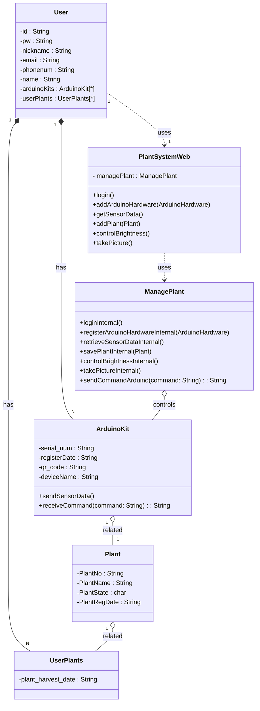
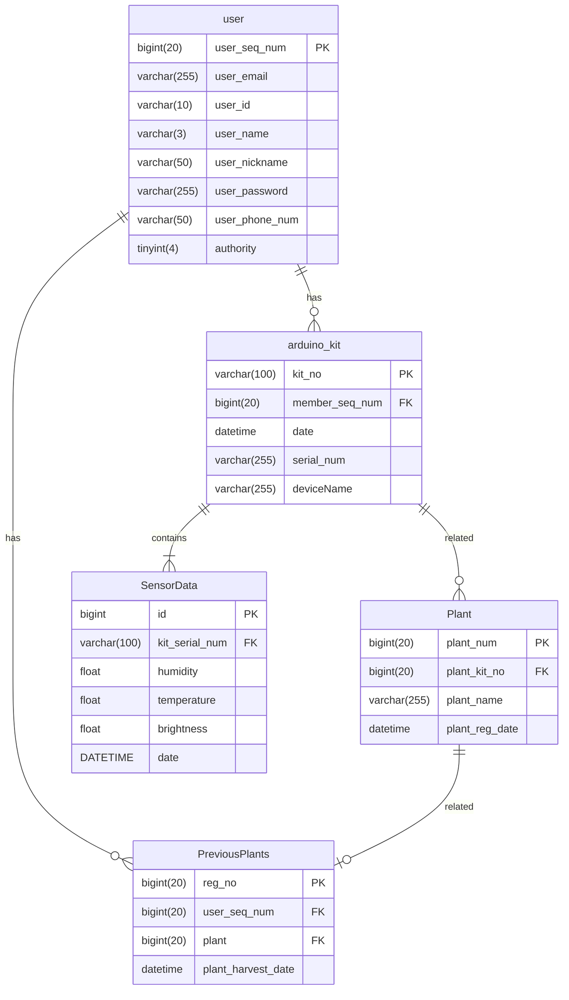

# KEBSmartFarm

# Project UML Class Diagram

```mermaid
classDiagram
    class User {
        -id : String
        -pw : String
	-nickname : String
	-email : String
	-phonenum : String
	-name : String
        -arduinoKits : ArduinoKit[*]
        -userPlants : UserPlants[*]
    }

    class ArduinoKit {
        -serial_num : String
        -registerDate : String
        -qr_code : String
        -deviceName : String
        +sendSensorData()
        +receiveCommand(command: String): String
    }

    class UserPlants {
        -plant_harvest_date : String
    }

    class Plant {
        -PlantNo : String
        -PlantName : String
        -PlantState : char
        -PlantRegDate : String
    }

    class PlantSystemWeb {
        - managePlant : ManagePlant
        +login()
        +addArduinoHardware(ArduinoHardware)
        +getSensorData()
        +addPlant(Plant)
        +controlBrightness()
        +takePicture()
    }

    class ManagePlant {
        +loginInternal()
        +registerArduinoHardwareInternal(ArduinoHardware)
        +retrieveSensorDataInternal()
        +savePlantInternal(Plant)
        +controlBrightnessInternal()
        +takePictureInternal()
        +sendCommandArduino(command: String): String
    }

    User "1" *-- "N" ArduinoKit : has
    User "1" *-- "N" UserPlants : has
    User "1" ..> "1" PlantSystemWeb : uses
    Plant "1" o-- "N" UserPlants : related
    ArduinoKit "1" o-- "1" Plant : related
    PlantSystemWeb ..> ManagePlant : uses
    ManagePlant o-- ArduinoKit : controls
```

# Project ER Diagram

```mermaid
erDiagram
  user ||--o{ arduino_kit : has
  user ||--o{ PreviousPlants : has
  Plant ||--o| PreviousPlants : related
	arduino_kit ||--o{ Plant : related
  arduino_kit ||--|{ SensorData : contains

  user {
    bigint(20) user_seq_num PK
    varchar(255) user_email
		varchar(10) user_id
    varchar(3) user_name
    varchar(50) user_nickname
    varchar(255) user_password 
    varchar(50) user_phone_num
		tinyint(4)	authority
  }

  arduino_kit {
    varchar(100) kit_no PK
		bigint(20) member_seq_num FK
    datetime date
    varchar(255) serial_num
    varchar(255) deviceName
  }

	PreviousPlants{
    bigint(20) reg_no PK
    bigint(20) user_seq_num FK
    bigint(20) plant FK
    datetime plant_harvest_date
  }

  Plant {
    bigint(20) plant_num PK
		bigint(20) plant_kit_no FK
    varchar(255) plant_name
    datetime plant_reg_date
  }

  SensorData {
    bigint id PK
    varchar(100) kit_serial_num FK
    float humidity
    float temperature
    float brightness
    DATETIME date
  }
```
