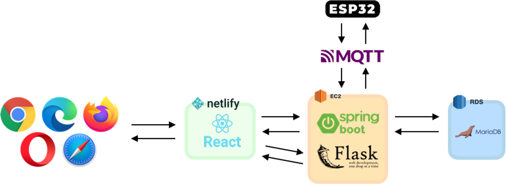
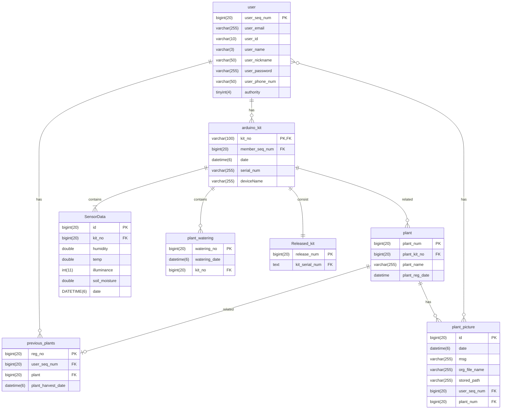
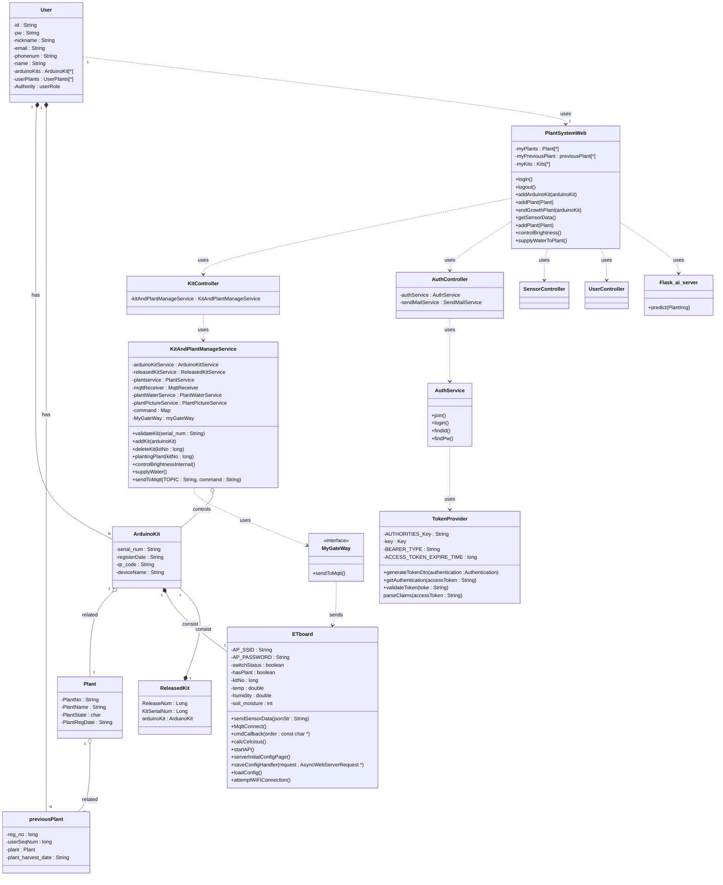

# README

# 개인화 식물 재배 및 관리 시스템 구축

### 아두이노 / 자바 스프링 / 리액트를 이용한 사용자 맞춤 반려식물 성장 서비스

## 🖥️ 프로젝트 소개

### 사용자의 환경에 맞춰 식물의 성장을 보조하는 플랫폼

### ✔ 주요 기능

- 키트에 탑재된 센서를 통해 해당 키트에 등록된 식물에게 필요한 정보들을 주변 환경을 고려하여 제공
- 원격에서 센서를 조작하여 빛 조절 또는 물 주기 가능
- 식물을 키우면서 관리할 수 있는 다이어리를 통해 사진과 기록을 남길 수 있음
- AI 이미지 분류를 통한 식물 검색 기능 제공

### 🕰️ 개발기간

- 23.07.24. - 23.08.23.

### 🧑‍🤝‍🧑 맴버구성

- 팀장 : 정균민 - 백엔드, 센서
- 팀원 : 김지성 - 프론트엔드, AI

### ⚙️ 기술 스텍

### Backend

   

### Frontend

       

### AI

    

### Sensor

  

### Deploy

  

## Architecture

## API Doc

## Class Diagram
# Project ER Diagram

## UML Diagram
# Project UML Class Diagram

## User flowchart

