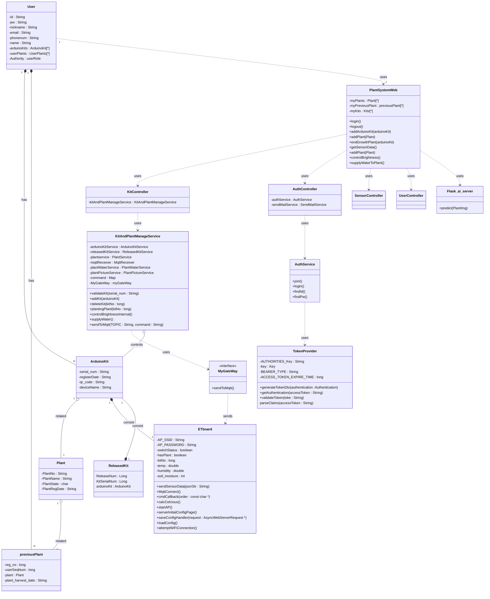

# Project UML Class Diagram

```mermaid
classDiagram
    class User {
    -id : String
    -pw : String
	-nickname : String
	-email : String
	-phonenum : String
	-name : String
    -arduinoKits : ArduinoKit[*]
    -userPlants : UserPlants[*]
    -Authority : userRole
    }

    class AuthService{
        +join()
        +login()
        +findId()
        +findPw()
    }

    class AuthController{
        -authService : AuthService
        -sendMailService : SendMailService
    
    }

    class TokenProvider {
        -AUTHORITIES_Key : String
        -key : Key
        -BEARER_TYPE : String
        -ACCESS_TOKEN_EXPIRE_TIME : long
        +generateTokenDto(authentication :Authentication)
        +getAuthentication(accessToken : String)
        +validateToken(toke : String)
        parseClaims(accessToken : String)
    }

    class ArduinoKit {
        -serial_num : String
        -registerDate : String
        -qr_code : String
        -deviceName : String
    }

    class ReleasedKit{
        ReleaseNum : Long
        KitSerialNum : Long
        arduinoKit : ArduinoKit
    }

    class previousPlant {
        -reg_no : long
        -userSeqNum : long
        -plant : Plant
        -plant_harvest_date : String
    }

    class Plant {
        -PlantNo : String
        -PlantName : String
        -PlantState : char
        -PlantRegDate : String
    }

    class PlantSystemWeb {
        -myPlants : Plant[*]
        -myPreviousPlant : previousPlant[*]
        -myKits : Kits[*]
        +login()
        +logout()
        +addArduinoKit(arduinoKit)
        +addPlant(Plant)
        +endGrowthPlant(arduinoKit)
        +getSensorData()
        +addPlant(Plant)
        +controlBrightness()
        +supplyWaterToPlant()
    }

    class KitController{
        -kitAndPlantManageService : KitAndPlantManageService
    }

    class SensorController{

    }

    class KitAndPlantManageService {
        -arduinoKitService : ArduinoKitService
        -releasedKitService : ReleasedKitService
        -plantservice : PlantService
        -mqttReceiver : MqttReceiver
        -plantWaterService : PlantWaterService
        -plantPictureService : PlantPictureService
        -command : Map<String, String>
        -MyGateWay : myGateWay
        +validateKit(serial_num : String)
        +addKit(arduinoKit)
        +deleteKit(kitNo : long)
        +plantingPlant(kitNo : long)
        +controlBrightnessInternal()
        +supplyWater()
        +sendToMqtt(TOPIC : String, command : String)
    }

    class ETboard{
        -AP_SSID : String
        -AP_PASSWORD : String
        -switchStatus : boolean
        -hasPlant : boolean
        -kitNo : long
        -temp : double
        -humidity : double
        -soil_moisture : int
        +sendSensorData(jsonStr : String)
        +MqttConnect()
        +cmdCallback(order : const char *)
        +calcCelcious()
        +startAP()
        +serverInitialConfigPage()
        +saveConfigHandler(request : AsyncWebServerRequest *)
        +loadConfig()
        +attemptWiFiConnection()
    }

    class MyGateWay{
        <<interface>>
        +sendToMqtt()
    }

    class Flask_ai_server {
        +predict(PlantImg)
    }

    User "1" *-- "N" ArduinoKit : has
    User "1" *-- "N" previousPlant : has
    User "1" ..> "1" PlantSystemWeb : uses
    Plant "1" o-- "N" previousPlant : related
    ArduinoKit "1" o-- "1" Plant : related
    ArduinoKit "1" *-- "1" ETboard : consist
    ArduinoKit "1" --* "1" ReleasedKit : consist
    PlantSystemWeb ..> KitController : uses
    PlantSystemWeb ..> AuthController : uses
    PlantSystemWeb ..> SensorController : uses
    PlantSystemWeb ..> UserController : uses
    AuthController ..> AuthService : uses
    KitController ..> KitAndPlantManageService : uses
    KitAndPlantManageService ..> MyGateWay : uses
    PlantSystemWeb ..> Flask_ai_server : uses
    MyGateWay ..> ETboard : sends
    AuthService ..> TokenProvider : uses
    KitAndPlantManageService o-- ArduinoKit : controls
```